# ClickStack Observability on HyperDX — Program Overview

**Audience:** Engineering leadership and stakeholders
**Purpose:** Explain the HyperDX dashboard suite — what we built, how it fits together, and the value it delivers
**Scope:** HyperDX dashboards + alerting on top of ClickStack telemetry
**Status:** Built and validated against live cluster data

> **Companion document:** This is the HyperDX counterpart to
> [`GRAFANA-OVERVIEW.md`](GRAFANA-OVERVIEW.md). HyperDX is our **investigation**
> layer (deep, interactive, click-through-to-traces); Grafana is our
> **at-a-glance health + paging** layer. Both read the same ClickHouse data.

---

## 1. Executive summary

We have built a **comprehensive, portable observability suite** on HyperDX that
turns the telemetry our platform already collects into **10 purpose-built
dashboards** and **automated alerting** — with no new agents and no schema
changes.

Where a metrics dashboard tells you *that* something is wrong, HyperDX lets an
engineer **click from a symptom straight into the underlying traces and logs** to
find the root cause. It is the everyday tool for service owners, SREs, platform
engineers, and ClickHouse operators.

| Layer | Tool | What it answers |
|-------|------|-----------------|
| **Investigation** *(this document)* | **HyperDX** | "Something is wrong — show me the traces, logs, and spans so I can find the root cause." |
| **At-a-glance health + paging** | Grafana | "Is everything healthy right now?" and "Tell me the moment it isn't." |

**What's included at a glance:**

- **10 HyperDX dashboards** spanning four telemetry domains — your applications,
  your Kubernetes cluster, the OpenTelemetry Collector, and ClickHouse itself.
- **5 automated alert rules** on the highest-signal conditions, delivered to
  **Microsoft Teams** by default.
- **Tiered adoption** — each dashboard lights up as you wire up the matching
  pipeline, with a **pre-flight check** that tells a customer exactly which ones
  will show data today.
- A **portable importer** so a customer can load the whole suite into their own
  HyperDX with one command.

---

## 2. How everything connects

The design principle is **collect once, use everywhere.** Applications, the
Kubernetes cluster, the OpenTelemetry Collector, and ClickHouse all emit
telemetry that lands in ClickHouse. HyperDX reads it back for search,
dashboards, and alerting.

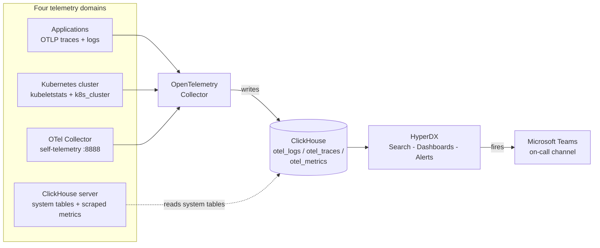

**Why this matters to the business:**

- **No extra collection cost or risk** — HyperDX is a read-only consumer of data
  we already store.
- **Symptom-to-root-cause in one click** — dashboard tables link directly into
  the raw traces and logs, so engineers resolve incidents faster.
- **Portable** — because everything relies only on ClickStack's standard
  OpenTelemetry schema, the same dashboards work on any customer's cluster
  unchanged.

---

## 3. The data foundation (the "schema contract")

Every dashboard reads from the **standard ClickStack OpenTelemetry schema** plus,
for the database dashboards, ClickHouse's own built-in `system.*` tables:

| Source | Contains | Powers |
|--------|----------|--------|
| `otel_traces` | Distributed traces / spans — every request, with duration and status | Services RED, SLO, Executive Overview |
| `otel_logs` | Application & system logs with severity | Logs Overview, Executive Overview |
| `otel_metrics_{gauge,sum,histogram}` | Kubernetes, Collector, and ClickHouse metrics | K8s Infrastructure, Collector Health, ClickHouse Health/Keeper |
| ClickHouse `system.*` (Raw SQL) | The database's own audit tables — `query_log`, `parts`, `part_log`, `replicas` | ClickHouse Query Perf, Storage, Keeper |

Because these are the **default OTel table names and columns**, the suite is
**portable**: a customer imports it, points HyperDX at their ClickHouse, and it
works. This "schema contract" is what makes the deliverable reusable rather than
a one-off.

**Baseline requirements (all dashboards):** HyperDX ≥ 2.27; the three default
HyperDX sources (Logs, Traces, Metrics); data in the standard ClickStack OTel
schema; and a Personal API Access Key to run the importer.

---

## 4. The four telemetry domains

A "Kubernetes cluster running on ClickHouse" is really **four independent
telemetry pipelines**. Each dashboard reads from one (or, for the Executive
Overview, all) of them:

| Domain | What produces the data | Dashboards |
|--------|------------------------|------------|
| **Your applications** | Services emit OTLP traces + logs | Services RED, SLO / Error Budget, Logs Overview |
| **Kubernetes infrastructure** | Collector `kubeletstats` + `k8s_cluster` receivers | K8s Infrastructure |
| **The OTel Collector itself** | Collector self-telemetry (`:8888`) scraped back | Collector Health |
| **ClickHouse (the database)** | `system.*` tables + scraped CH metrics | ClickHouse Health, Query Perf, Storage, Keeper |
| **Everything (roll-up)** | All of the above; degrades gracefully | Executive Overview |

### Adoption tiers — what works with how much setup

The dashboards are **not all-or-nothing**; each lights up when its pipeline is
configured. A bundled **pre-flight check** (`./preflight.ps1` / `.sh`) rates each
one **OK / DEGRADED / FAIL** against a live install so customers import only what
will show data today.

| Tier | Needs | Dashboards |
|------|-------|-----------|
| 🟢 **1 — any ClickHouse, zero setup** | Just `SELECT` on `system.*` | Storage |
| 🟡 **2 — ClickHouse metrics scraped** | `clickhouse`/Prometheus receiver | Cluster Health, Query Perf, Keeper |
| 🟠 **3 — specific collector receivers** | `kubeletstats`+`k8s_cluster`; collector `:8888` | K8s Infrastructure, Collector Health |
| 🔵 **4 — apps instrumented** | OTLP traces / logs | Services RED, SLO, Logs Overview |
| ⭐ **Always works** | Degrades gracefully | Executive Overview |

> **The easy path:** the standard ClickStack distribution wires up the k8s,
> collector-self, and ClickHouse receivers automatically — so **all 10 light
> up**. The tiers matter mainly for hand-rolled or partial setups.

---

## 5. The dashboards

Ten dashboards, each answering a specific question for a specific audience.

| Dashboard | Domain | Primary audience | Answers |
|-----------|--------|------------------|---------|
| **Executive Overview** | all | Leadership / on-call lead | "Is anything on fire, across the whole stack?" |
| **Services — RED** | apps (traces) | Service owners / SRE | "Which service is slow or erroring, on which route?" |
| **Services — SLO / Error Budget** | apps (traces) | SRE / reliability owners | "Are we inside our SLO, and how fast are we burning budget?" |
| **Logs — Overview** | apps (logs) | On-call / incident triage | "What's erroring, and what's *new* since the last deploy?" |
| **Kubernetes — Infrastructure** | k8s (metrics) | Platform / infra | "Is the cluster healthy — nodes, pods, deployments?" |
| **OTel Collector — Pipeline Health** | collector (metrics) | Observability pipeline owner | "Is telemetry itself flowing, or being dropped?" |
| **ClickHouse — Cluster Health** | ClickHouse (metrics) | DBA / platform | "Is the database healthy — queries, merges, replication?" |
| **ClickHouse — Query Performance** | ClickHouse (SQL+metrics) | DBA / perf engineer | "Which queries are slow or failing, and why?" |
| **ClickHouse — Storage & MergeTree** | ClickHouse (SQL) | DBA / capacity planner | "Disk, compression, and are parts/merges under control?" |
| **ClickHouse — Keeper & Replication** | ClickHouse (metrics+SQL) | Cluster operators | "Is replica coordination healthy?" |

Most dashboards include **Service** and/or **Namespace** filter dropdowns and a
time-range picker, and many tables **click through directly into the raw Traces
or Logs** — the core HyperDX advantage.

### 5.1 Executive Overview ⭐

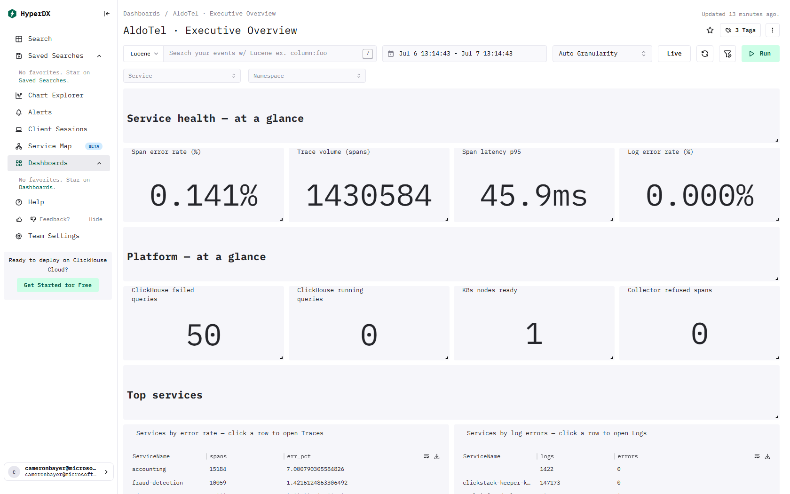

*A cross-domain landing page: service and platform health at a glance, plus
click-through "top services" tables.*

**Purpose & audience:** The first dashboard to import and the one for the shared
screen. Leaders get a 5-second "is anything on fire?" read; engineers use the
tables to jump straight into the offending Traces or Logs.

**What you'll see:** service health (span error rate %, trace volume, p95
latency, log error rate %); platform health (ClickHouse failed/running queries,
K8s nodes ready, collector refused spans); *Services by error rate* → Traces and
*Services by log errors* → Logs; and ingest throughput. Every tile degrades
gracefully, so it's the safest first import and shows coverage grow as pipelines
come online.

### 5.2 Services — RED (Rate / Errors / Duration) 🔵

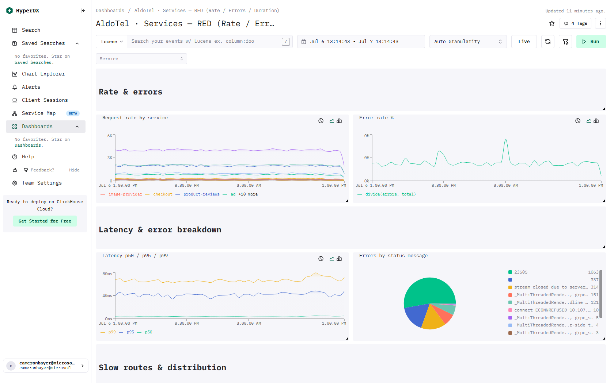

*The classic RED view per service and per route, with a latency heatmap and
anomaly control chart.*

**Purpose & audience:** The everyday dashboard for service owners and SREs —
"which service is slow or erroring right now, and on which endpoint?"

**What you'll see:** request rate and error rate % by service; p50/p95/p99
latency; errors by status message; slowest routes by p95 (→ Traces); a
latency-anomaly control chart; and a server-latency heatmap. *Needs OTLP server
spans.*

### 5.3 Services — SLO / Error Budget 🔵

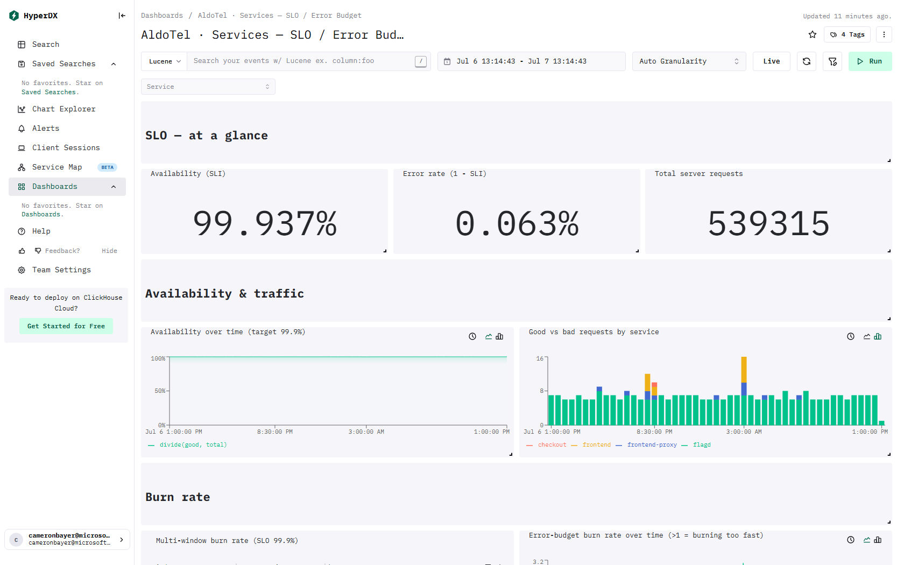

*Reframes raw errors as SLO language: availability, error budget, and
multi-window burn rate.*

**Purpose & audience:** For teams running to Service Level Objectives. It turns
"0.06% errors" into "you're inside your 99.9% budget" and shows *how fast* you're
spending it — the number that actually predicts a breach.

**What you'll see:** availability (SLI), error rate (1 − SLI), total requests;
availability over time vs a 99.9% target; good vs bad requests by service; a
multi-window burn-rate table (1h/6h/24h/3d) where **> 1 = spending budget faster
than allowed**; and errors by service (→ Traces). The bundled **SLO fast-burn
alert** watches exactly this.

### 5.4 Logs — Overview 🔵

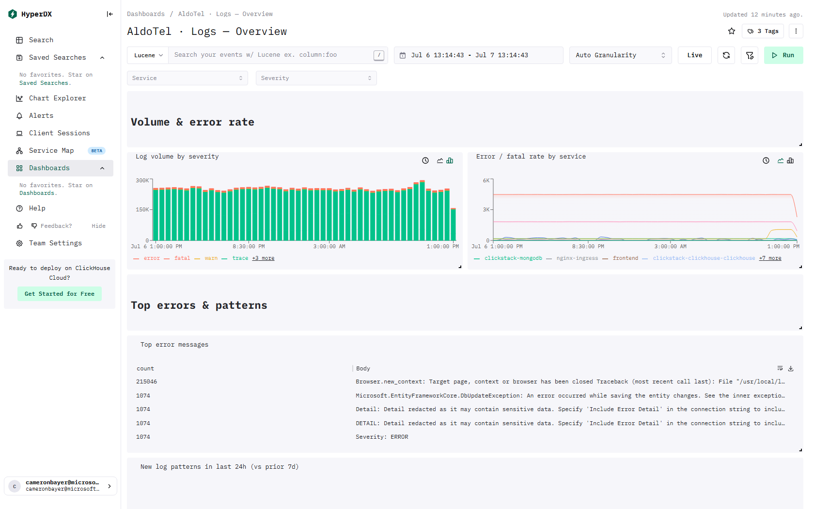

*Volume, severity mix, top errors, a live error stream — and newly appeared
error patterns.*

**Purpose & audience:** For anyone triaging an incident or a deploy. Its standout
feature — **new log patterns in the last 24h vs the prior 7 days** — answers
*"what started happening that wasn't before?"*, a cheap deploy-aware anomaly
detector.

**What you'll see:** log volume by severity; error/fatal rate by service; top
error messages (→ Logs); new-pattern detection; and a live error stream to watch
during a rollout.

### 5.5 Kubernetes — Infrastructure 🟠

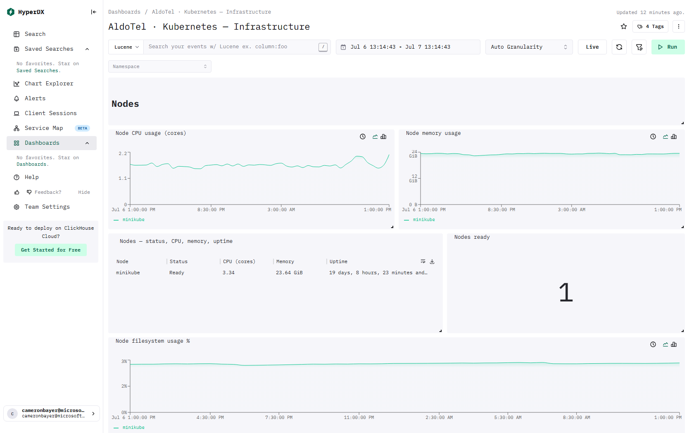

*Nodes, pods, deployments, and namespaces — CPU, memory, restarts, and
availability.*

**Purpose & audience:** For platform / infrastructure engineers. When a service
is unhealthy, this tells you whether the cause is the *platform* (node OOM, pods
crash-looping, deployment under-replicated) rather than the app code.

**What you'll see:** node CPU/memory and status; nodes-ready count; deployment
availability (ready/desired); pods by phase; pod CPU/memory vs limits (early
warning for OOMKills/throttling); and per-namespace resource summaries. *Needs
`kubeletstats` + `k8s_cluster` receivers.*

### 5.6 OTel Collector — Pipeline Health 🟠

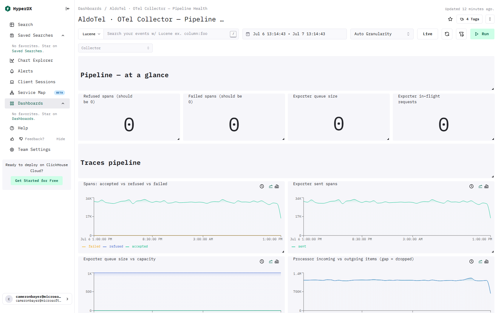

*The meta-monitor: accepted vs refused vs failed telemetry, queue depth, and
processor drops.*

**Purpose & audience:** For whoever owns the observability pipeline. If this shows
refused/failed spans or a full exporter queue, **every other dashboard's data is
suspect** because telemetry is being dropped before it lands.

**What you'll see:** refused and failed spans (both should be 0); exporter queue
size vs capacity; processor incoming vs outgoing (**a gap = dropped data**); log
and metric pipeline throughput; scraper errors; and collector CPU/memory. The
bundled **collector-drops alert** watches refused spans.

### 5.7 ClickHouse — Cluster Health 🟡

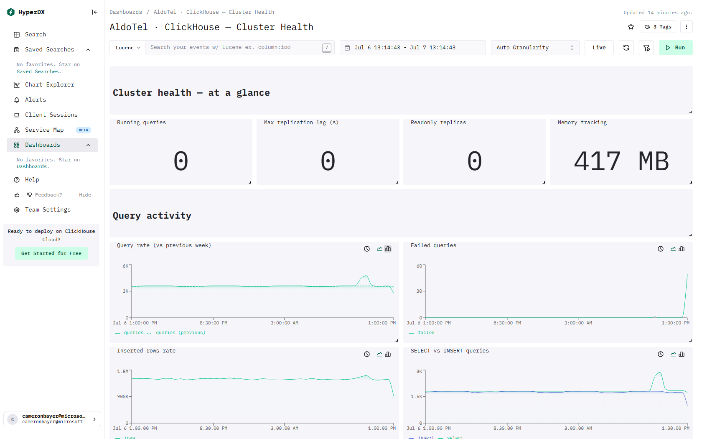

*Is the database healthy? Query/insert throughput, failures, merges, memory, and
replication lag.*

**Purpose & audience:** For ClickHouse operators / DBAs. ClickHouse is the engine
under HyperDX (and often the customer's own analytics) — this is the "is the
database healthy?" view.

**What you'll see:** running queries, max replication lag, readonly replicas,
memory tracking; query rate (with week-over-week comparison); failed queries;
insert-rows rate; merges and mutations in progress; and cache I/O.

### 5.8 ClickHouse — Query Performance & Errors 🟡

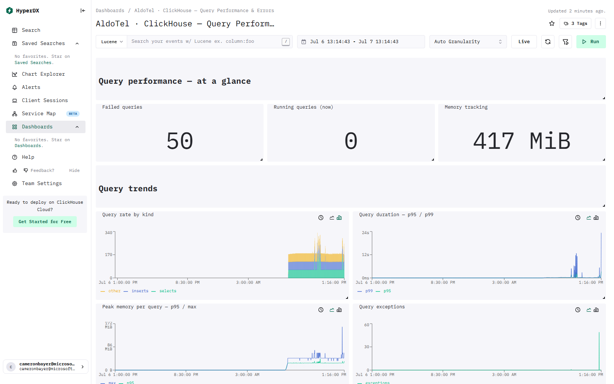

*A deep look at query behavior, read straight from ClickHouse's own
`system.query_log`.*

**Purpose & audience:** For DBAs and performance engineers tuning ClickHouse. When
queries are slow or failing, this pinpoints *which* queries and *why*.

**What you'll see:** failed/running queries and memory tracking; query rate by
kind; p95/p99 query duration; peak memory per query; query exceptions; the actual
**slowest queries (last 6h)**; and top ClickHouse error codes. *Most tiles are
Raw SQL needing zero metrics setup.*

### 5.9 ClickHouse — Storage & MergeTree 🟢

*The storage layer — disk, compression, part counts, and MergeTree churn. Works
on any ClickHouse with zero setup.*

**Purpose & audience:** For DBAs and capacity planners — and the easiest
dashboard to adopt (no metrics pipeline at all). Its **too-many-parts watch** is
an early warning for the single most common ClickHouse operational failure.

**What you'll see:** disk used, compression ratio, active parts, rows stored;
part events / 5 min (inserts, merges, mutations); merge duration; bytes written;
largest tables by disk; and active parts per table. The bundled **too-many-parts
alert** watches this.

### 5.10 ClickHouse — Keeper & Replication 🟡

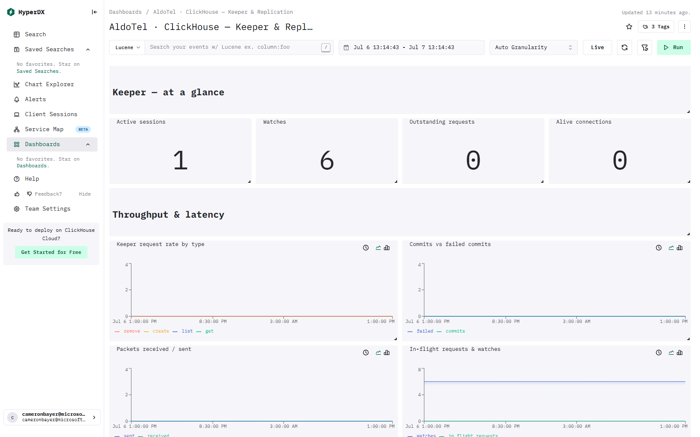

*The coordination layer of a replicated ClickHouse: Keeper sessions, throughput,
latency, and replica status.*

**Purpose & audience:** For operators of replicated / clustered ClickHouse. Keeper
is the consensus service that keeps replicas in sync; when replication stalls,
this shows stuck queue tasks and unhealthy replicas.

**What you'll see:** active sessions, watches, outstanding requests; request rate
and commit latency; a Keeper errors table; and replica status / replication queue
(*replicated clusters only — empty on single-node by design, which is expected*).

---

## 6. Alerting — what it is and why it matters

The suite ships **five HyperDX alerts** — one for each condition an operator
actually wants to be woken up for. Each alert **binds to a specific dashboard
tile** and pages a channel when the signal breaches a threshold. Thresholds are
opinionated defaults, tunable per install.

### 6.1 The five alerts

| Alert | Watches (tile · dashboard) | Fires when | Interval |
|-------|----------------------------|-----------|----------|
| **Services error rate** | Error rate % · Services RED | error ratio **> 2%** | 5m |
| **SLO fast burn** | Error rate (1 − SLI) · SLO | **> 1.44%** (= 14.4× burn of a 99.9% SLO) | 5m |
| **Collector dropping telemetry** | Refused spans · Collector Health | refused spans **> 0** | 5m |
| **ClickHouse too many parts** | Active parts (total) · Storage | total active parts **> 5000** | 15m |
| **ClickHouse replication lag** | Max replication lag (s) · Cluster Health | lag **> 60s** | 5m |

These map to the four questions that matter: *Are requests failing? Are we
burning our reliability budget too fast? Is telemetry itself being dropped? And
is the database healthy (parts + replication)?*

### 6.2 How an alert works (in plain terms)

Each alert is **attached to a dashboard tile** (a `line` or `number` tile — the
types HyperDX can alert on). HyperDX re-evaluates the tile's value on a schedule
(e.g. every 5 minutes) and, when it crosses the threshold, sends a notification.
Because the alert rides on the same query that draws the tile, **what you see on
the dashboard is exactly what the alert measures** — no drift between the two.

### 6.3 Where alerts go (routing)

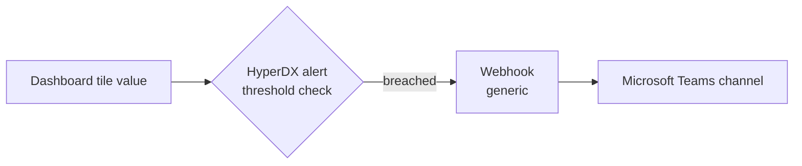

- **Channel:** HyperDX has no dedicated Teams integration, so a Teams channel is
  configured as a **`generic` webhook** pointing at a Teams Incoming Webhook URL.
  Slack and incident.io are also supported.
- **Portable & idempotent:** the importer resolves the per-install
  dashboard/tile/webhook IDs at import time and matches alerts by
  `(dashboard, tile)`, so re-running never creates duplicates.

### 6.4 Tuning

Every threshold and interval is a single value the customer edits in the alert
JSON (then re-imports) or directly in the HyperDX UI. Defaults suit a busy
staging cluster; production teams tighten or loosen per environment. *(Note:
`collector-drops` is zero-tolerance by default — raise it if your environment has
benign transient refusals.)*

---

## 7. Delivery & portability — how a customer installs it

The suite is designed for **"import and go."**

1. **Get a Personal API Access Key** — HyperDX → *Team Settings → API Keys*.
2. **Run the pre-flight check** — `./preflight.ps1` / `.sh` rates each dashboard
   against the live install and prints an `--only` command listing the ones that
   will show data today.
3. **Import the dashboards** — `./import.ps1` / `.sh` (or `-Only <files>` for a
   subset). Portable by design: no hard-coded IDs; the importer resolves
   per-install source/connection IDs.
4. **Import the alerts** — `./import-alerts.ps1` / `.sh` after adding a Teams (or
   Slack) webhook in *Team Settings → Webhooks*. Idempotent and re-runnable.

Every dashboard also has a **per-tile reference doc** in
[`docs/`](docs/) with a live screenshot, and a **customer catalog** in
[`DASHBOARD-CATALOG.md`](DASHBOARD-CATALOG.md) explaining *which and why*.

---

## 8. What makes this solution strong

- **Zero added collection cost / risk** — read-only on data we already store.
- **Portable by design** — relies only on ClickStack's standard schema, so it
  works on any customer's cluster unchanged.
- **Symptom-to-root-cause** — dashboard tables click straight into the raw traces
  and logs; the Logs "new patterns" tile is a deploy-aware anomaly detector.
- **Tiered, honest adoption** — a pre-flight check means customers import only
  what will show data, so nothing lands empty or confuses their team.
- **Complete coverage** — apps, Kubernetes, the collector pipeline, *and* the
  ClickHouse database itself, from executive summary down to individual queries.
- **Validated, not theoretical** — every dashboard was captured against live
  cluster data; alerts bind to real tiles and page via webhook.

---

## 9. Considerations & next steps

**Operational notes**

- **Metric names can vary by collector config** — the defaults are verified
  against live OSS ClickStack; the pre-flight check flags any mismatch to adjust.
- **Replicated-only tiles** (Keeper replication) are intentionally empty on
  single-node ClickHouse — expected, not a fault.
- **Credentials** — the API key and any Teams webhook are treated as environment
  secrets, kept out of version control.

**How HyperDX and Grafana complement each other**

- **HyperDX** = deep investigation, click-through to traces/logs, richest for
  engineers debugging an incident.
- **Grafana** ([`GRAFANA-OVERVIEW.md`](GRAFANA-OVERVIEW.md)) = at-a-glance health
  walls and customer-owned alerting/on-call routing.
- Both share one data set, so there is a single source of truth and no duplicated
  collection cost.

**Possible enhancements (not yet built)**

- Additional app-signal dashboards (per-team service views, dependency maps).
- More alerts (e.g. log fatal-rate, K8s pod-not-ready) to reach parity with the
  Grafana alert set.

---

## 10. Glossary

| Term | Meaning |
|------|---------|
| **ClickStack** | The telemetry stack (HyperDX + OpenTelemetry + ClickHouse) that collects and stores our observability data. |
| **HyperDX** | The observability UI for searching telemetry and building dashboards/alerts on ClickHouse. |
| **ClickHouse** | The high-performance database where all telemetry is stored. |
| **OpenTelemetry (OTel)** | The vendor-neutral standard for collecting traces, logs, and metrics. |
| **OTel Collector** | The agent that receives telemetry and writes it to ClickHouse; also emits its own health metrics. |
| **RED method** | Rate, Errors, Duration — the standard way to measure service health. |
| **SLO / error budget / burn rate** | A reliability target, how much failure you can still absorb, and how fast you're consuming it. |
| **p95 / p99** | The value under which 95% / 99% of measurements fall — better than an average for spotting outliers. |
| **Span / trace** | A single unit of work (span) and the end-to-end path of a request (trace). |
| **MergeTree / parts** | ClickHouse's storage engine and its on-disk data fragments; too many parts is a common failure mode. |
| **Keeper** | ClickHouse's consensus/coordination service that keeps replicas in sync. |
| **Webhook** | A URL HyperDX posts to when an alert fires (a Teams channel, in our default). |

---

*This suite is built, validated against live data, and ready to hand to customers
or other internal teams.*
