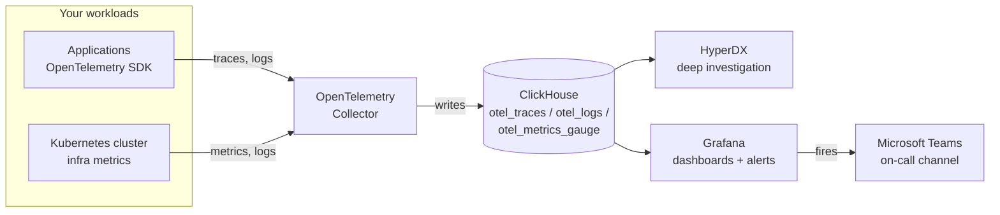
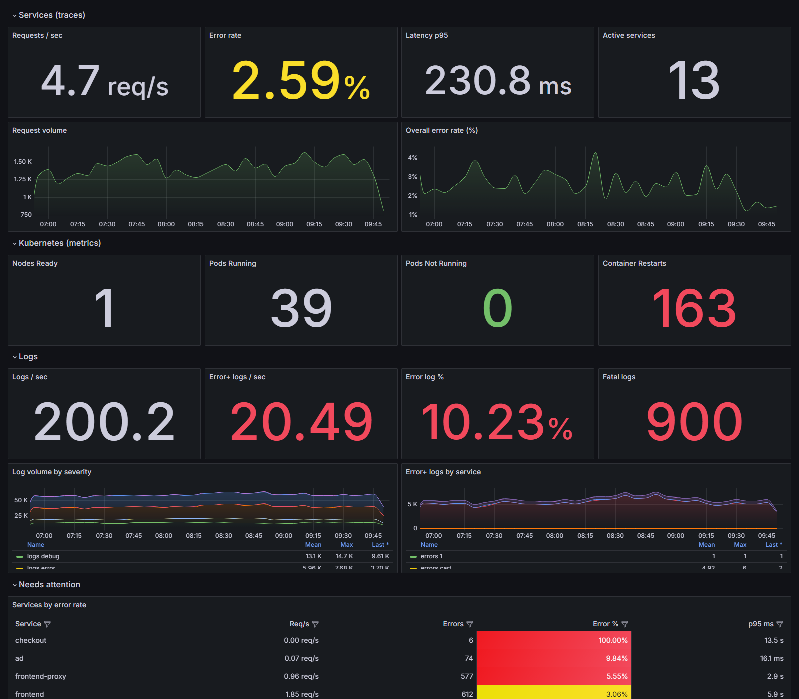
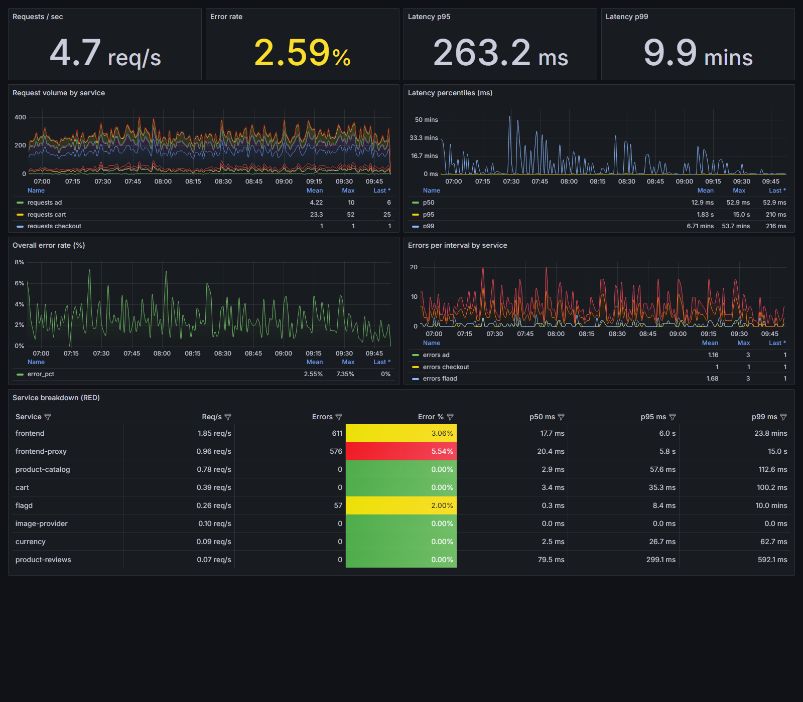
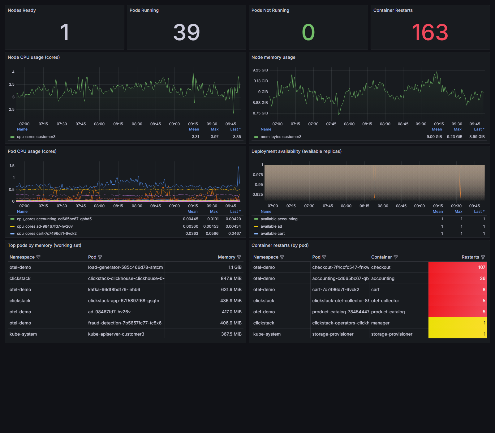
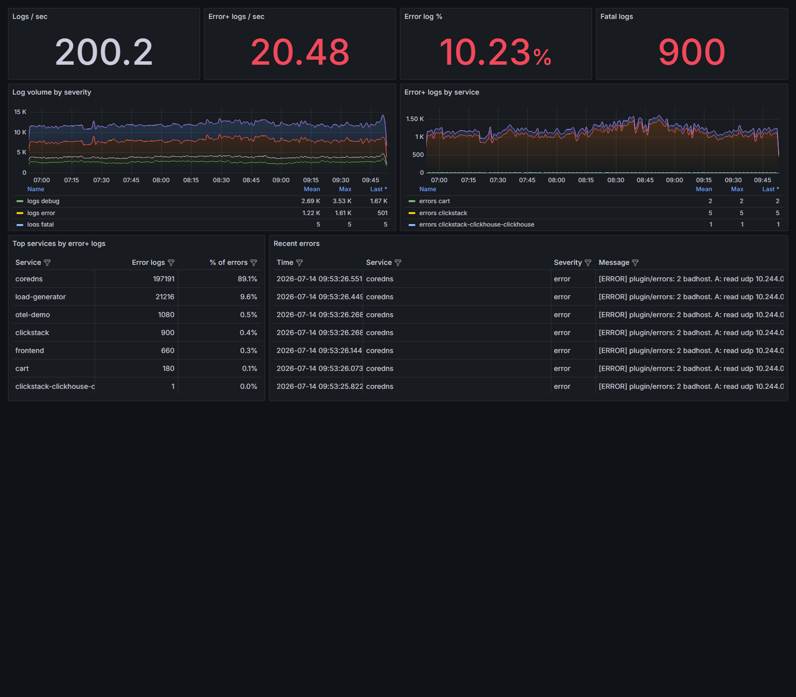
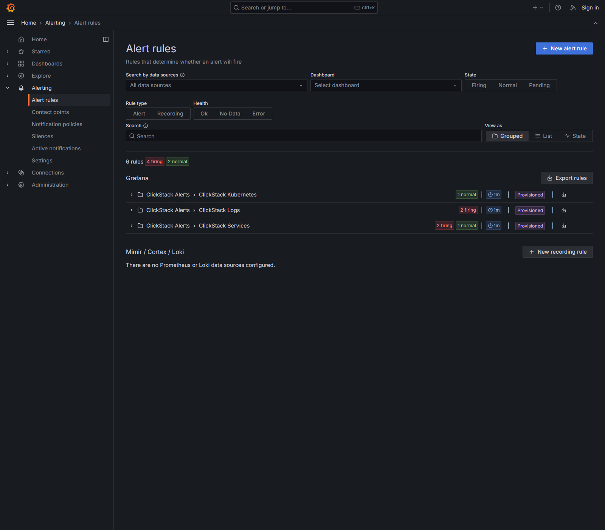
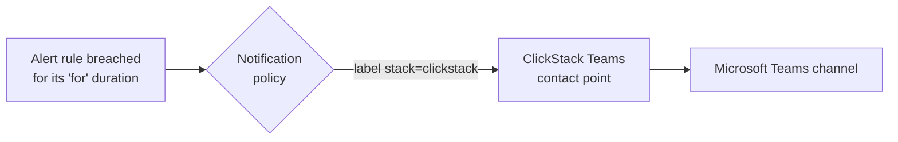

# ClickStack Observability on Grafana — Program Overview

**Audience:** Engineering leadership and stakeholders
**Purpose:** Explain what we built, how it fits together, and the value it delivers
**Scope:** Grafana dashboards + alerting on top of ClickStack telemetry
**Status:** Built and validated against live cluster data

---

## 1. Executive summary

We have delivered a **portable observability package** that turns the telemetry
our platform already collects into **at-a-glance operational dashboards** and
**automated alerting** — with no new agents, no schema changes, and no vendor
lock-in.

The package has two complementary layers:

| Layer | Tool | What it answers |
|-------|------|-----------------|
| **Investigation** | HyperDX | "Something is wrong — show me the traces, logs, and spans so I can find the root cause." |
| **At-a-glance health + paging** | **Grafana** *(this document)* | "Is everything healthy right now?" and "Tell me the moment it isn't." |

Both layers read the **same underlying data**, so there is a single source of
truth and no duplicated collection cost. Everything is packaged so a customer
(or another internal team) can **download it and stand it up on their own
Grafana in minutes**.

**What's included at a glance:**

- **4 Grafana dashboards** covering services, Kubernetes, logs, and an
  executive summary (40+ visualization panels total).
- **6 automated alert rules** covering the highest-signal failure modes,
  delivered to **Microsoft Teams** by default.
- **Three install paths** so it works on any Grafana — self-hosted, Dockerized,
  Kubernetes, or Grafana Cloud.

---

## 2. How everything connects

The design principle is simple: **collect once, use everywhere.** Our
applications and Kubernetes cluster emit standard OpenTelemetry data. ClickStack
stores it in ClickHouse. Grafana and HyperDX both read from that same store.

**Why this matters to the business:**

- **No extra cost or risk to add Grafana** — it's a read-only consumer of data
  we already store. Nothing changes in the collection pipeline.
- **One data set, two lenses** — HyperDX for engineers debugging an incident,
  Grafana for a health wall and automated paging.
- **Portable** — because everything relies only on ClickStack's standard
  OpenTelemetry schema, the exact same dashboards and alerts work on any
  customer's cluster without modification.

---

## 3. The data foundation (the "schema contract")

Every dashboard and alert reads from three standard tables that ClickStack
populates automatically:

| Table | Contains | Powers |
|-------|----------|--------|
| `otel_traces` | Distributed traces / spans — every request through every service, with duration and success/error status | Service Health, Executive Summary, service alerts |
| `otel_logs` | Application and system logs with severity (info/warn/error/fatal) | Logs & Errors, Executive Summary, log alerts |
| `otel_metrics_gauge` | Kubernetes infrastructure metrics — pod phase, CPU, memory, restarts | Kubernetes Overview, Executive Summary, infra alerts |

Because these are the **default OpenTelemetry table names and columns**, the
package is **datasource-agnostic**: a customer simply points it at their own
ClickHouse and it works. This "schema contract" is what makes the deliverable
reusable rather than a one-off.

---

## 4. The Grafana dashboards

Four dashboards, each answering a specific operational question for a specific
audience.

| Dashboard | Reads from | Primary audience | Answers |
|-----------|-----------|------------------|---------|
| **Executive Summary** | all three | Leadership / on-call lead | "Is the whole platform healthy right now?" |
| **Service Health (Golden Signals)** | `otel_traces` | Service owners / SRE | "Are my services up, fast, and error-free?" |
| **Kubernetes Cluster Overview** | `otel_metrics_gauge` | Platform / infra team | "Is the cluster healthy — nodes, pods, resources?" |
| **Logs & Errors Overview** | `otel_logs` | On-call engineers | "What is erroring, how much, and what do the errors say?" |

### 4.1 Executive Summary

*Live view: service golden signals, Kubernetes health, log rates, and a "needs attention" table — all on one screen.*

**Purpose:** A single pane that combines the top signals from all three data
sources — the "is anything on fire?" view. Intentionally **unfiltered** so it is
always the complete picture.

**What it shows:**

- **Services:** requests/sec, error rate, p95 latency, active service count,
  plus request-volume and error-rate trends over time.
- **Kubernetes:** nodes ready, pods running, pods *not* running, container
  restart count.
- **Logs:** logs/sec, error-and-above logs/sec, error-log percentage, fatal-log
  count, plus log-volume-by-severity and errors-by-service trends.
- **Needs attention:** a ranked table of services by error rate, so the worst
  offender is immediately visible.

**Manager takeaway:** This is the screen to put on a wall monitor. Green = fine;
any red number or rising trend is a prompt to drill into one of the other three
dashboards.

### 4.2 Service Health — Golden Signals

*Per-service Rate, Errors, and Duration — with latency percentiles and a full RED breakdown table.*

**Purpose:** The classic **RED method** (Rate, Errors, Duration) per service —
the industry-standard way to judge application health.

**What it shows:** requests/sec, error rate, p95 and p99 latency (headline
numbers); request volume by service, latency percentiles, overall error-rate
trend, errors-per-interval by service (trends); and a full **RED breakdown
table** per service.

**Filter:** a **Service** dropdown to focus on one or more services.

**Manager takeaway:** Directly answers "are our services meeting expectations?"
and pinpoints which service is degrading.

### 4.3 Kubernetes Cluster Overview

*Node and pod health, CPU/memory, deployment availability, and container restarts.*

**Purpose:** Infrastructure health of the cluster the workloads run on.

**What it shows:** nodes ready, pods running / not running, container restarts
(headline); node CPU and memory, pod CPU, deployment availability (trends); and
tables for top pods by memory and container restarts by pod.

**Filter:** a **Namespace** dropdown. (Cluster-wide node panels are intentionally
not namespace-filtered, since nodes are shared.)

**Manager takeaway:** Separates "the app has a bug" from "the platform is
starved / unstable" — critical for routing an incident to the right team.

### 4.4 Logs & Errors Overview

*Log volume by severity, error rate, top erroring services, and the latest error messages themselves.*

**Purpose:** Understand logging volume and surface the actual error content.

**What it shows:** logs/sec, error-and-above logs/sec, error-log %, fatal-log
count (headline); log volume by severity and error logs by service (trends); top
services by error volume; and a **Recent errors** table showing the latest error
messages themselves.

**Filter:** a **Service** dropdown.

**Manager takeaway:** Turns a wall of logs into a ranked, readable view of what
is actually going wrong and where.

### 4.5 Filters (how they work)

Three of the four dashboards include **dropdown filters** (Service or Namespace)
at the top. They are multi-select and default to **All**, so every panel can be
narrowed to just the workloads a team cares about without editing anything. The
Executive Summary is deliberately unfiltered as the always-on overview.

---

## 5. Alerting — what it is and why it matters

Dashboards tell you something is wrong **when you're looking**. Alerts tell you
**the moment it happens, whether or not anyone is watching.** This is the primary
reason we chose Grafana for this layer: it lets the customer own their alerting
and on-call routing in one place.

### 5.1 The six alerts

Each alert targets a high-signal, unambiguous failure mode. Thresholds are
**opinionated defaults that customers can tune.**

| # | Alert | Data source | Fires when | Default threshold | Severity |
|---|-------|-------------|-----------|-------------------|----------|
| 1 | **Service error rate high** | `otel_traces` | a service returns too many errors | > 5% (per service) | Warning |
| 2 | **Service p95 latency high** | `otel_traces` | a service gets slow | > 2000 ms (per service) | Warning |
| 3 | **Trace ingestion stalled** | `otel_traces` | telemetry stops arriving (pipeline down) | < 1 span in 10 min | **Critical** |
| 4 | **Pods not Running** | `otel_metrics_gauge` | pods stuck outside Running | > 0 pods | Warning |
| 5 | **Error log rate high** | `otel_logs` | error/fatal logs surge | > 5 logs/sec | Warning |
| 6 | **Fatal logs present** | `otel_logs` | any fatal (crash-level) log appears | > 0 | **Critical** |

Together these cover the four questions that matter most: *Are requests failing?
Are they slow? Is the platform (pods) healthy? And is telemetry itself still
flowing?* — plus a direct crash signal via fatal logs.

*The six rules live in Grafana, grouped by domain and provisioned as code. This
capture from the running cluster shows them actively evaluating — 3 firing, 1
pending, 2 normal — proving the pipeline works end-to-end.*

### 5.2 How an alert works (in plain terms)

Every rule runs the same three-step evaluation on a schedule (every minute):

1. **Query** — ask ClickHouse a question (e.g. "what is each service's error
   rate over the last 10 minutes?").
2. **Reduce** — collapse the answer to a single current number per service.
3. **Threshold** — compare that number to the limit; if it's breached, start a
   countdown.

An alert only fires after the condition holds for a **"for" duration** (e.g. 5
minutes) — this prevents noisy, flapping alerts from momentary blips. Alerts that
measure per-service metrics fire **individually per service**, so a notification
names exactly which service is affected.

### 5.3 Where alerts go (routing)

- **Contact point:** a **Microsoft Teams** channel by default (the customer
  pastes in a Teams webhook URL). Email, Slack, PagerDuty, etc. are one-line
  swaps.
- **Notification policy:** routes only our alerts (tagged `stack=clickstack`) to
  Teams, leaving any existing alerting the customer already has untouched.

### 5.4 Tuning

Every threshold and timing is a single, documented value the customer can edit:
the trigger number, the "for" duration (sensitivity), and the evaluation
frequency. Defaults are set for a busy staging/demo cluster; production teams
typically tighten or loosen them per service.

---

## 6. Delivery & portability — how a customer installs it

A key design goal was **"download and run."** Dashboards and alerts install
through two different Grafana mechanisms, which is worth understanding:

| Package | Mechanism | Effort |
|---------|-----------|--------|
| **Dashboards** (JSON) | **UI import** — upload the file, pick your ClickHouse connection | Seconds, no restart |
| **Alerts** (YAML) | **Server provisioning** — Grafana reads them from disk at startup | Copy files + restart |

Because alert rules are org-level *configuration* (they touch contact points and
routing), Grafana does not offer a browser "upload" for them the way it does for
dashboards. To cover every environment, we ship **three install paths for
alerts**:

1. **File provisioning** — drop the YAML into Grafana's provisioning folder and
   restart. Best for self-hosted / Docker / Kubernetes (via ConfigMap).
2. **Terraform** — creates the same rules via the Grafana API, no filesystem
   needed. **This is the path for Grafana Cloud** and locked-down managed
   Grafana. (Validated against the official Grafana Terraform provider.)
3. **Manual UI recreation** — for teams that prefer to click through the builder.

The **one setup detail** customers must get right: the alerts reference the
ClickHouse connection by a fixed ID (`clickstack-ch`), so they either name their
datasource that ID or do a one-line find-and-replace. Dashboards have no such
requirement — they prompt for the connection on import.

---

## 7. What makes this solution strong

- **Zero added collection cost / risk** — read-only on data we already store.
- **Portable by design** — relies only on ClickStack's standard schema, so it
  works on any customer's cluster unchanged.
- **Right tool for each job** — HyperDX for investigation, Grafana for health +
  paging, one shared data set.
- **Customer-owned alerting** — teams route to their own Teams/Slack/PagerDuty
  and tune thresholds without touching our code.
- **Validated, not theoretical** — every dashboard panel and alert query was run
  against live cluster data; alerts were observed firing end-to-end
  (e.g. service error rate and fatal-log alerts) and routing correctly.
- **Fully documented** — customer-facing READMEs, an install quick-start, and
  per-dashboard/alert breakdowns ship with the package.

---

## 8. Considerations & next steps

**Operational notes**

- **Data-source ID convention** (`clickstack-ch`) is the single install gotcha —
  clearly documented, but worth flagging in onboarding.
- **Grafana Cloud** cannot use file provisioning for alerts; the Terraform path
  covers this.
- **Credentials** — the ClickHouse read user and any Teams webhook are treated as
  environment secrets, kept out of version control.

**Possible enhancements (not yet built)**

- Additional alerts (e.g. container-restart spikes, per-service latency
  allow-lists to reduce noise on intentionally slow services).
- An API-based install script as a fourth, lighter-weight alert install option
  (token + one command, no Terraform, no filesystem).
- SLO / error-budget dashboards and burn-rate alerts for services with formal
  targets.

---

## 9. Glossary

| Term | Meaning |
|------|---------|
| **ClickStack** | The telemetry stack (HyperDX + OpenTelemetry + ClickHouse) that collects and stores our observability data. |
| **ClickHouse** | The high-performance database where all telemetry is stored. |
| **OpenTelemetry (OTel)** | The vendor-neutral standard for collecting traces, logs, and metrics. |
| **Golden Signals / RED** | Rate, Errors, Duration — the standard way to measure service health. |
| **p95 / p99 latency** | The response time under which 95% / 99% of requests complete; better than an average for spotting slow outliers. |
| **Span / trace** | A single unit of work (span) and the end-to-end path of a request (trace). |
| **Contact point** | Where Grafana sends a notification (Teams, email, etc.). |
| **Provisioning** | Configuring Grafana from files on disk rather than clicking through the UI. |

---

*This package is built, validated against live data, and ready to hand to
customers or other internal teams.*
