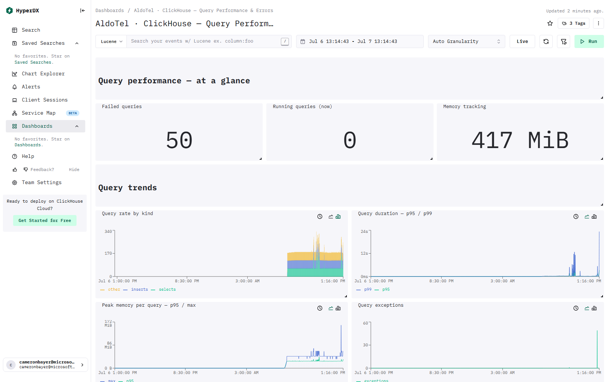

# ClickStack · ClickHouse — Query Performance & Errors

> This page lists the ClickHouse tables and columns behind every visual on the dashboard.

[← Reference index](README.md) · [Dashboard catalog](../DASHBOARD-CATALOG.md) · [Deep dive](../DASHBOARD-DEEP-DIVE.md) · [HyperDX install guide](../README.md)

- **Template:** `dashboards/advanced/clickhouse-queryperf.json` · tag `tmpl:clickhouse-queryperf`
- **Data required:** ClickHouse metrics scraped into OTel (for the summary number tiles); Most tiles read system.query_log via Raw SQL — the HyperDX ClickHouse connection user must be able to SELECT from system.query_log, and query_log must be enabled

## Preview



_Live capture from a ClickStack install with the OpenTelemetry demo flowing._

## Query performance — at a glance

### Failed queries — number · Raw SQL

- **Tables:** `default.otel_metrics_sum`

<details><summary>SQL query</summary>

```sql
SELECT sum(d) AS "Failed queries" FROM (
  SELECT greatest(max(Value) - min(Value), 0) AS d
  FROM default.otel_metrics_sum
  WHERE TimeUnix >= fromUnixTimestamp64Milli({startDateMilliseconds:Int64})
    AND TimeUnix <= fromUnixTimestamp64Milli({endDateMilliseconds:Int64})
    AND MetricName = 'ClickHouseProfileEvents_FailedQuery'
  GROUP BY ResourceAttributes['service.instance.id']
)
```

</details>

### Running queries (now) — number

- **Source / table:** Metrics → `default.otel_metrics_gauge`
- **Metric(s):** `ClickHouseMetrics_Query`  (column `MetricName`)
- **Measure(s):** last_value(`Value`)
- **Columns used:** `Value`, `MetricName`, `TimeUnix`

### Memory tracking — number

- **Source / table:** Metrics → `default.otel_metrics_gauge`
- **Metric(s):** `ClickHouseMetrics_MemoryTracking`  (column `MetricName`)
- **Measure(s):** max(`Value`)
- **Columns used:** `Value`, `MetricName`, `TimeUnix`

## Query trends

### Query rate by kind — stacked_bar · Raw SQL

- **Tables:** `system.query_log`

<details><summary>SQL query</summary>

```sql
SELECT toStartOfInterval(event_time, INTERVAL {intervalSeconds:Int64} SECOND) AS t,
       countIf(query_kind = 'Select') AS selects,
       countIf(query_kind = 'Insert') AS inserts,
       countIf(query_kind NOT IN ('Select','Insert')) AS other
FROM system.query_log
WHERE type = 'QueryFinish'
  AND event_time >= fromUnixTimestamp64Milli({startDateMilliseconds:Int64})
  AND event_time <= fromUnixTimestamp64Milli({endDateMilliseconds:Int64})
GROUP BY t
ORDER BY t
```

</details>

### Query duration — p95 / p99 — line · Raw SQL

- **Tables:** `system.query_log`

<details><summary>SQL query</summary>

```sql
SELECT toStartOfInterval(event_time, INTERVAL {intervalSeconds:Int64} SECOND) AS t,
       quantile(0.95)(query_duration_ms) / 1000 AS p95,
       quantile(0.99)(query_duration_ms) / 1000 AS p99
FROM system.query_log
WHERE type = 'QueryFinish'
  AND event_time >= fromUnixTimestamp64Milli({startDateMilliseconds:Int64})
  AND event_time <= fromUnixTimestamp64Milli({endDateMilliseconds:Int64})
GROUP BY t
ORDER BY t
```

</details>

### Peak memory per query — p95 / max — line · Raw SQL

- **Tables:** `system.query_log`

<details><summary>SQL query</summary>

```sql
SELECT toStartOfInterval(event_time, INTERVAL {intervalSeconds:Int64} SECOND) AS t,
       quantile(0.95)(memory_usage) AS p95,
       max(memory_usage) AS max
FROM system.query_log
WHERE type = 'QueryFinish'
  AND event_time >= fromUnixTimestamp64Milli({startDateMilliseconds:Int64})
  AND event_time <= fromUnixTimestamp64Milli({endDateMilliseconds:Int64})
GROUP BY t
ORDER BY t
```

</details>

### Query exceptions — line · Raw SQL

- **Tables:** `system.query_log`

<details><summary>SQL query</summary>

```sql
SELECT toStartOfInterval(event_time, INTERVAL {intervalSeconds:Int64} SECOND) AS t,
       countIf(exception_code != 0) AS exceptions
FROM system.query_log
WHERE type >= 2
  AND event_time >= fromUnixTimestamp64Milli({startDateMilliseconds:Int64})
  AND event_time <= fromUnixTimestamp64Milli({endDateMilliseconds:Int64})
GROUP BY t
ORDER BY t
```

</details>

## Slowest queries & errors

### Slowest queries — table · Raw SQL

- **Tables:** `system.query_log`

<details><summary>SQL query</summary>

```sql
SELECT event_time,
       user,
       query_kind,
       query_duration_ms,
       formatReadableSize(memory_usage) AS memory,
       read_rows,
       substring(query, 1, 160) AS query
FROM system.query_log
WHERE type = 'QueryFinish'
  AND event_time >= fromUnixTimestamp64Milli({startDateMilliseconds:Int64})
  AND event_time <= fromUnixTimestamp64Milli({endDateMilliseconds:Int64})
ORDER BY query_duration_ms DESC
LIMIT 20
```

</details>

### Top errors (from query_log) — table · Raw SQL

- **Tables:** `system.query_log`

<details><summary>SQL query</summary>

```sql
SELECT exception_code,
       count() AS errors,
       substring(argMax(exception, event_time), 1, 500) AS sample_exception
FROM system.query_log
WHERE type >= 2
  AND event_time >= fromUnixTimestamp64Milli({startDateMilliseconds:Int64})
  AND event_time <= fromUnixTimestamp64Milli({endDateMilliseconds:Int64})
  AND exception_code != 0
GROUP BY exception_code
ORDER BY errors DESC
LIMIT 20
```

</details>
