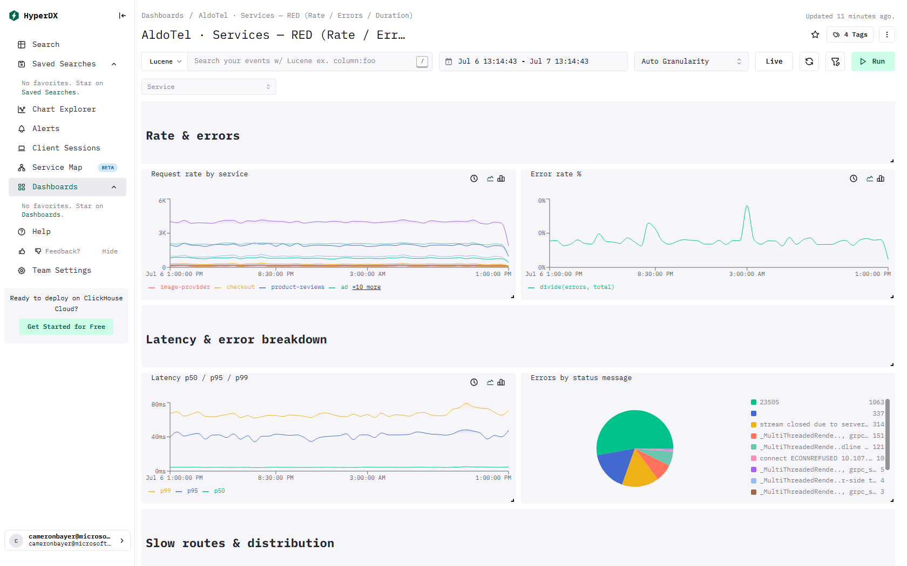

# ClickStack · Services — RED (Rate / Errors / Duration)

> This page lists the ClickHouse tables and columns behind every visual on the dashboard.

[← Reference index](README.md) · [Dashboard catalog](../DASHBOARD-CATALOG.md) · [Deep dive](../DASHBOARD-DEEP-DIVE.md) · [HyperDX install guide](../README.md)

- **Template:** `dashboards/services-red.json` · tag `tmpl:services-red`
- **Data required:** Application traces (OTLP)

## Preview



_Live capture from a ClickStack install with the OpenTelemetry demo flowing._

## Dashboard filters

These apply to every compatible tile on the dashboard.

| Filter | Column / expression | Source |
|---|---|---|
| Service | `ServiceName` | Traces (`default.otel_traces`) |

## Rate & errors

### Request rate by service — line

- **Source / table:** Traces → `default.otel_traces`
- **Measure(s):** count(*) as `requests`  — where `SpanKind:Server` (lucene)
- **Group by:** `ServiceName`
- **Columns used:** `ServiceName`, `SpanKind`

### Error rate % — line

- **Source / table:** Traces → `default.otel_traces`
- **Measure(s):** count(*) as `errors`  — where `SpanKind:Server AND StatusCode:Error` (lucene); count(*) as `total`  — where `SpanKind:Server` (lucene)
- **Group by:** `ServiceName`
- **Columns used:** `ServiceName`, `StatusCode`, `SpanKind`

## Latency & error breakdown

### Latency p50 / p95 / p99 — line

- **Source / table:** Traces → `default.otel_traces`
- **Measure(s):** quantile(`Duration / 1000000000`) as `p50`  — where `SpanKind = 'Server'` (sql); quantile(`Duration / 1000000000`) as `p95`  — where `SpanKind = 'Server'` (sql); quantile(`Duration / 1000000000`) as `p99`  — where `SpanKind = 'Server'` (sql)
- **Columns used:** `Duration`, `SpanKind`

### Errors by status message — pie

- **Source / table:** Traces → `default.otel_traces`
- **Measure(s):** count(*) as `errors`  — where `SpanKind:Server AND StatusCode:Error` (lucene)
- **Group by:** `StatusMessage`
- **Columns used:** `StatusCode`, `StatusMessage`, `SpanKind`

## Slow routes & distribution

### Slowest routes (p95) — min 20 requests — table · Raw SQL

- **Tables:** `default.otel_traces`

<details><summary>SQL query</summary>

```sql
SELECT ServiceName AS "Service", route AS "Route", round(p95_ms, 1) AS "p95 (ms)", round(p50_ms, 1) AS "p50 (ms)", requests AS "Requests" FROM (
  SELECT ServiceName,
         SpanAttributes['http.route'] AS route,
         quantile(0.95)(Duration) / 1e6 AS p95_ms,
         quantile(0.5)(Duration) / 1e6 AS p50_ms,
         count() AS requests
  FROM default.otel_traces
  WHERE SpanKind = 'Server'
    AND Timestamp >= fromUnixTimestamp64Milli({startDateMilliseconds:Int64})
    AND Timestamp <= fromUnixTimestamp64Milli({endDateMilliseconds:Int64})
    AND SpanAttributes['http.route'] != ''
    AND $__filters
  GROUP BY ServiceName, route
  HAVING requests >= 20
)
ORDER BY p95_ms DESC
LIMIT 50
```

</details>

### Latency anomaly — p95 vs rolling baseline (±3σ control band) — line · Raw SQL

- **Tables:** `default.otel_traces`

<details><summary>SQL query</summary>

```sql
WITH points AS (
  SELECT toStartOfInterval(Timestamp, INTERVAL 5 MINUTE) AS t,
         quantile(0.95)(Duration)/1e6 AS p95_ms
  FROM default.otel_traces
  WHERE SpanKind = 'Server' AND Timestamp > now() - INTERVAL 8 DAY AND $__filters
  GROUP BY t
),
scored AS (
  SELECT t, p95_ms,
         avg(p95_ms)       OVER (ORDER BY t ROWS BETWEEN 288 PRECEDING AND 12 PRECEDING) AS base,
         stddevPop(p95_ms) OVER (ORDER BY t ROWS BETWEEN 288 PRECEDING AND 12 PRECEDING) AS sigma
  FROM points
)
SELECT t,
       p95_ms,
       base AS baseline_ms,
       base + 3 * sigma AS upper_ms,
       greatest(base - 3 * sigma, 0) AS lower_ms
FROM scored
WHERE t >= now() - INTERVAL 24 HOUR
ORDER BY t
```

</details>

### Server latency distribution (heatmap, seconds) — heatmap

- **Source / table:** Traces → `default.otel_traces`
- **Measure(s):** `Duration / 1000000000` bucketed, count `count()`
- **Filter:** `SpanKind:Server` (lucene)
- **Columns used:** `Duration`, `SpanKind`

## SLO & error budget
Availability = successful server requests / total server requests. Burn-rate windows (1h / 6h / 24h / 3d) are **fixed SLO windows** and intentionally ignore the time picker; a burn rate > 1 means the 99.9% budget is being spent too fast.

### Availability (SLI) — number

- **Source / table:** Traces → `default.otel_traces`
- **Measure(s):** avg(`if(StatusCode = 'Error', 0, 1)`) as `availability`  — where `SpanKind:Server` (lucene)
- **Columns used:** `StatusCode`, `SpanKind`

### Error budget remaining (window, SLO 99.9%) — number · Raw SQL

- **Tables:** `default.otel_traces`

<details><summary>SQL query</summary>

```sql
SELECT 1 - (countIf(SpanKind = 'Server' AND StatusCode = 'Error') / nullIf(countIf(SpanKind = 'Server'), 0)) / 0.001 AS "Budget remaining"
FROM default.otel_traces
WHERE Timestamp >= fromUnixTimestamp64Milli({startDateMilliseconds:Int64})
  AND Timestamp <= fromUnixTimestamp64Milli({endDateMilliseconds:Int64})
  AND $__filters
```

</details>

### Multi-window burn rate (SLO 99.9%) — table · Raw SQL

- **Tables:** `default.otel_traces`

<details><summary>SQL query</summary>

```sql
WITH 0.001 AS budget
SELECT window,
       round(error_ratio, 5) AS error_ratio,
       round(error_ratio / budget, 2) AS burn_rate
FROM (
  SELECT '1h' AS window, 1 AS ord,
         countIf(SpanKind = 'Server' AND StatusCode = 'Error') / nullIf(countIf(SpanKind = 'Server'), 0) AS error_ratio
  FROM default.otel_traces WHERE Timestamp > now() - INTERVAL 1 HOUR AND $__filters
  UNION ALL
  SELECT '6h', 2,
         countIf(SpanKind = 'Server' AND StatusCode = 'Error') / nullIf(countIf(SpanKind = 'Server'), 0)
  FROM default.otel_traces WHERE Timestamp > now() - INTERVAL 6 HOUR AND $__filters
  UNION ALL
  SELECT '24h', 3,
         countIf(SpanKind = 'Server' AND StatusCode = 'Error') / nullIf(countIf(SpanKind = 'Server'), 0)
  FROM default.otel_traces WHERE Timestamp > now() - INTERVAL 24 HOUR AND $__filters
  UNION ALL
  SELECT '3d', 4,
         countIf(SpanKind = 'Server' AND StatusCode = 'Error') / nullIf(countIf(SpanKind = 'Server'), 0)
  FROM default.otel_traces WHERE Timestamp > now() - INTERVAL 3 DAY AND $__filters
)
ORDER BY ord
```

</details>

### Availability over time (target 99.9%) — line

- **Source / table:** Traces → `default.otel_traces`
- **Measure(s):** count(*) as `good`  — where `SpanKind:Server AND NOT StatusCode:Error` (lucene); count(*) as `total`  — where `SpanKind:Server` (lucene)
- **Columns used:** `StatusCode`, `SpanKind`
